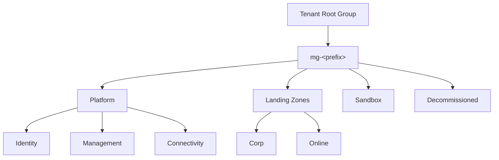
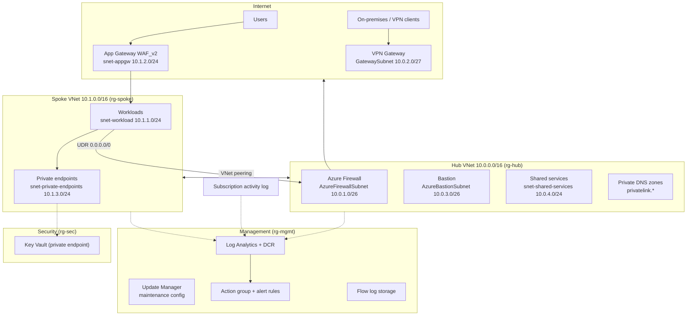

# Architecture

## Management group hierarchy



Opt-in (`enable_management_groups`); see [governance.md](governance.md#management-groups) for why and how policy scope migrates.

## Topology



## Design decisions

### Hub-spoke over Virtual WAN
Classic hub-spoke gives full control over routing and firewall policy at a lower entry cost. Migrate to Virtual WAN when you exceed ~3 regions or need managed any-to-any transit.

### Forced tunnelling
The spoke's workload and private-endpoint subnets carry a route table sending `0.0.0.0/0` to the firewall's private IP with BGP propagation disabled. All egress is inspected; the firewall's DNS proxy is authoritative for spoke name resolution, which private DNS zone resolution requires when queries originate on-premises.

The `nic-no-public-ip` policy assignment (Deny) exists to protect this invariant — a public IP on a NIC creates a return path that skips the route table entirely, so the firewall never sees the traffic.

### Zone redundancy
Firewall, VPN Gateway, Bastion and Application Gateway public IPs are pinned to zones 1–3. Storage defaults to ZRS. Confirm the target region supports availability zones (not all do); set `zones = []` / `zones: []` for regions without them.

### The Application Gateway ships TLS-only, with an unreachable placeholder listener

Two things are true of the shipped default and both are deliberate:

- The gateway has an **HTTP listener on port 80**. Application Gateway will not deploy with zero listeners, and an HTTPS listener needs a certificate the module cannot invent. It sits inside `ignore_changes`, so a workload can replace it without fighting Terraform.
- The gateway subnet NSG allows **443 from the internet only**. So that placeholder listener is not reachable from outside — which is the point. A public WAF serving plaintext HTTP is not a default worth shipping.

Net effect: `curl http://<gateway-ip>` times out on a fresh deploy. That is expected. To serve traffic:

1. Add an HTTPS listener with a certificate from Key Vault (via a user-assigned identity).
2. If you want the usual HTTP→HTTPS redirect, add the port 80 NSG rule — it is written out as a comment in `modules/spoke-network/main.tf` (Terraform) and `spokeNetwork.bicep`.

The `ssl_policy` is pinned to `AppGwSslPolicy20220101S`: TLS 1.2 floor, strong ciphers only. That applies to every listener you add, so the TLS floor is set once at the gateway rather than per-listener.

The port 80 rule is written out rather than exposed as a variable on purpose. A conditional rule reads as "port 80 open" to every static scanner, which costs the guarantee that the subnet is TLS-only by default.

### Bastion runs behind its documented NSG

`AzureBastionSubnet` carries the full rule set Microsoft requires — control plane (`GatewayManager`, `AzureLoadBalancer` on 443), data plane (`BastionHostCommunication` on 8080/5701), outbound SSH/RDP to the VNet, and 80/443 to the internet for session information and CRL checks. Bastion breaks if any of it is missing, so do not tidy these rules. The private endpoint subnet has its own NSG (VNet-only inbound, deny the rest), which only takes effect because that subnet sets `private_endpoint_network_policies = "Enabled"`.

### Identity-first data plane
- Key Vault: RBAC authorization (no access policies), public network access disabled.
- Storage: shared-key auth **disabled**, OAuth default, public access disabled. Data-plane access is via Entra ID roles (e.g. `Storage Blob Data Contributor`) over the private endpoint.
- **Exception**: the flow log storage account keeps shared-key access enabled, because the Network Watcher flow log writer authenticates with the account key. It is a separate account so this exception does not leak into workload storage.

### Peering & gateway transit
The hub peering advertises the VPN gateway (`allow_gateway_transit`); the spoke consumes it (`use_remote_gateways`), so on-premises networks reach spoke workloads through the hub. Spoke deployment therefore depends on the gateway existing first.

### Private DNS zone set
Beyond the usual PaaS zones, the default list includes the complete **Azure Monitor private link set**:

```
privatelink.monitor.azure.com
privatelink.oms.opinsights.azure.com
privatelink.ods.opinsights.azure.com
privatelink.agentsvc.azure-automation.net
privatelink.blob.core.windows.net
```

All five must be present together. A partial set is worse than none: Azure Monitor Agent resolves some endpoints privately and others publicly, and ingestion fails in ways that produce no obvious error. The blob zone is shared with storage private endpoints, which is why it appears once in the list.

Creating the zones does not by itself force Monitor traffic private — that needs an Azure Monitor Private Link Scope (AMPLS) linked to the workspace and hub VNet. The zones are the prerequisite; add AMPLS when you are ready to close the last public egress path for telemetry.

### Observability is part of the platform, not an add-on
Diagnostic settings on individual resources only cover the data plane. The **subscription activity log** diagnostic setting is what captures who changed what, and the AMA install + DCR association policies are what make the data collection rule actually collect from VMs. All three are deployed by default; see [governance.md](governance.md#monitoring-alerting--diagnostics).

## IP address plan

| Network | Range | Purpose |
|---|---|---|
| Hub VNet | 10.0.0.0/16 | Platform/connectivity |
| — AzureFirewallSubnet | 10.0.1.0/26 | Fixed name required by Azure |
| — GatewaySubnet | 10.0.2.0/27 | Fixed name required by Azure |
| — AzureBastionSubnet | 10.0.3.0/26 | /26 minimum for Bastion |
| — snet-shared-services | 10.0.4.0/24 | Domain controllers, jump infra, shared PEs |
| Spoke VNet | 10.1.0.0/16 | First workload landing zone |
| — snet-workload | 10.1.1.0/24 | Application compute |
| — snet-appgw | 10.1.2.0/24 | Dedicated App Gateway subnet |
| — snet-private-endpoints | 10.1.3.0/24 | PaaS private endpoints |
| P2S client pool | 172.16.0.0/24 | Must not overlap any VNet or on-prem range |
| Reserved | 10.2.0.0/16 + | Future spokes (copy the spoke module per workload) |

## Adding a spoke

The root modules deploy **one** spoke deliberately: a second workload landing zone normally belongs in its own subscription with its own state, not bolted into the platform's. To add one:

1. Reserve the next /16 (or right-sized block) from the plan above.
2. Terraform: instantiate `modules/spoke-network` again with the new range; Bicep: add another `spokeNetwork` + two `vnetPeering` module blocks.
3. Add the spoke's range to `spoke_address_space`-driven firewall rules if it needs the platform egress allowances.
4. Link the new VNet to the private DNS zones (`module.private_dns.virtual_network_ids`).
5. Add it to `virtual_network_ids` in the flow-logs module if flow logs are enabled.

For a genuinely multi-subscription estate, enable the management group hierarchy and run this stack once per platform subscription, with workload landing zones deploying only the spoke module against the shared hub.

## Cost considerations

Always-on platform components dominate the bill (rough, region-dependent):

| Component | Driver |
|---|---|
| Azure Firewall | ~€700+/mo Standard, ~€1200+/mo Premium + data processing |
| Application Gateway WAF_v2 | Capacity units + fixed hourly |
| VPN Gateway VpnGw1AZ | Fixed hourly |
| Bastion Standard | Fixed hourly + scale units |
| Defender for Cloud | Per-resource per plan |
| Log Analytics | Per-GB ingestion — set `log_daily_quota_gb` in non-prod |
| DDoS Network Protection | ~USD 3k/mo flat, **per tenant** — share one plan, do not create one per landing zone |
| Traffic Analytics | Per-GB on top of flow log storage |

For dev/test: `firewall_sku_tier = "Standard"`, drop Bastion to Basic (or deploy on demand), disable the App Gateway module, cap workspace ingestion, and leave `enable_ddos_protection` and `enable_flow_logs` off.

Set `monthly_budget_amount` so the forecast alert warns you before month-end rather than after.
