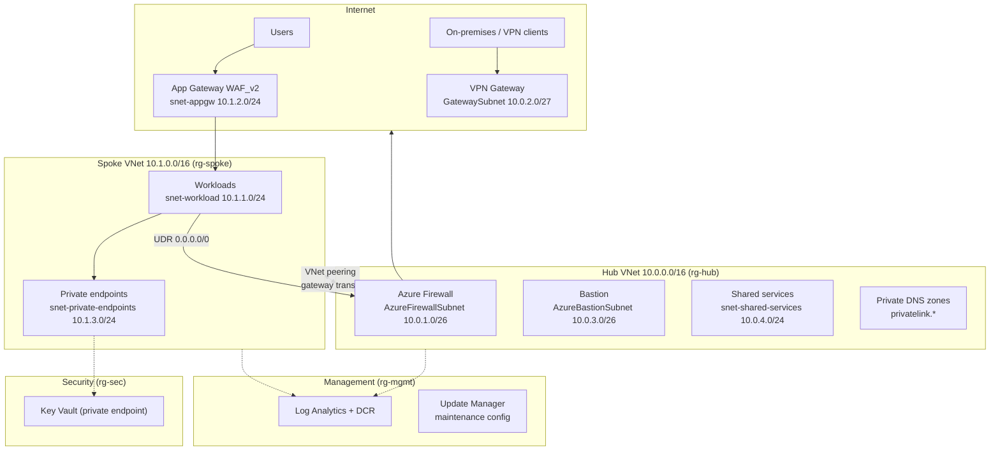

# Architecture

## Topology

## Design decisions

### Hub-spoke over Virtual WAN
Classic hub-spoke gives full control over routing and firewall policy at a lower entry cost. Migrate to Virtual WAN when you exceed ~3 regions or need managed any-to-any transit.

### Forced tunnelling
The spoke's workload and private-endpoint subnets carry a route table sending `0.0.0.0/0` to the firewall's private IP with BGP propagation disabled. All egress is inspected; the firewall's DNS proxy is authoritative for spoke name resolution, which private DNS zone resolution requires when queries originate on-premises.

### Zone redundancy
Firewall, VPN Gateway public IP, and Application Gateway are pinned to zones 1–3. Storage defaults to ZRS. Confirm the target region supports availability zones (not all do); set `zones = []` / `zones: []` for regions without them.

### Identity-first data plane
- Key Vault: RBAC authorization (no access policies), public network access disabled.
- Storage: shared-key auth **disabled**, OAuth default, public access disabled. Data-plane access is via Entra ID roles (e.g. `Storage Blob Data Contributor`) over the private endpoint.

### Peering & gateway transit
The hub peering advertises the VPN gateway (`allow_gateway_transit`); the spoke consumes it (`use_remote_gateways`), so on-premises networks reach spoke workloads through the hub. Spoke deployment therefore depends on the gateway existing first.

## IP address plan

| Network | Range | Purpose |
|---|---|---|
| Hub VNet | 10.0.0.0/16 | Platform/connectivity |
| — AzureFirewallSubnet | 10.0.1.0/26 | Fixed name required by Azure |
| — GatewaySubnet | 10.0.2.0/27 | Fixed name required by Azure |
| — AzureBastionSubnet | 10.0.3.0/26 | /26 minimum for Bastion |
| — snet-shared-services | 10.0.4.0/24 | Domain controllers, jump infra, shared PEs |
| Spoke VNet | 10.1.0.0/16 | First workload landing zone |
| — snet-workload | 10.1.1.0/24 | Application compute |
| — snet-appgw | 10.1.2.0/24 | Dedicated App Gateway subnet |
| — snet-private-endpoints | 10.1.3.0/24 | PaaS private endpoints |
| P2S client pool | 172.16.0.0/24 | Must not overlap any VNet or on-prem range |
| Reserved | 10.2.0.0/16 + | Future spokes (copy the spoke module per workload) |

## Adding a spoke

1. Reserve the next /16 (or right-sized block) from the plan above.
2. Terraform: instantiate `modules/spoke-network` again with the new range; Bicep: add another `spokeNetwork` + two `vnetPeering` module blocks.
3. Add the spoke's range to `spoke_address_space`-driven firewall rules if it needs the platform egress allowances.
4. Link the new VNet to the private DNS zones.

## Cost considerations

Always-on platform components dominate the bill (rough, region-dependent):

| Component | Driver |
|---|---|
| Azure Firewall | ~€700+/mo Standard, ~€1200+/mo Premium + data processing |
| Application Gateway WAF_v2 | Capacity units + fixed hourly |
| VPN Gateway VpnGw1AZ | Fixed hourly |
| Bastion Standard | Fixed hourly + scale units |
| Defender for Cloud | Per-resource per plan |
| Log Analytics | Per-GB ingestion — set `daily_quota_gb` in non-prod |

For dev/test: `firewall_sku_tier = "Standard"`, drop `Bastion` to Basic (or deploy on demand), disable the App Gateway module, and cap workspace ingestion.
